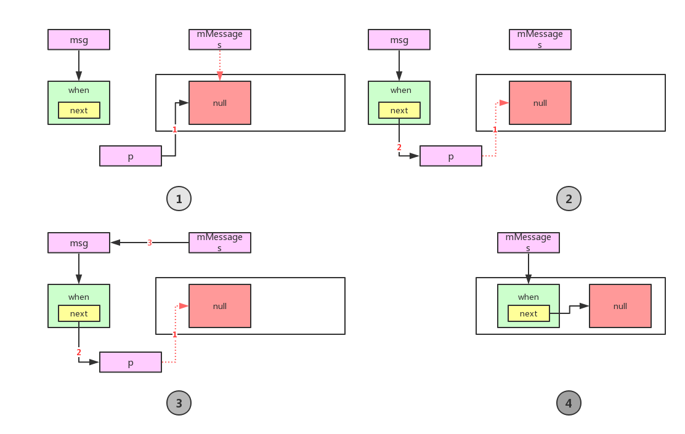

# Android消息机制

## epoll
```c
int epoll_create (int/*size*/)
int epoll_ctl (int/*epfd*/, int/*operation*/, int/*fd*/,struct epoll_event * /*events*/)
int epoll_wait (int/*epfd*/, struct epoll_event * /*events*/,int/*max size*/, int/*timeout*/)
```

## eventfd
```c
int eventfd (int /*count*/, int/*flags*/)
int eventfd_read (int /*fd*/, eventfd_t * /*value*/) //down
int eventfd_write (int /*fd*/, eventfd_t /*value*/) //up
```
flags

    EFD_CLOEXEC
    EFD_NONBLOCK
    EFD_SEMAPHORE

## pthread
Thread Local Data.
```c
void pthread_once() //保证只执行一次，具体那个线程执行由内核决定。
void pthread_key_create(&pthread_key_t) //创建键值
void pthread_setspecific(pthread_key_t,void*) //设置键值
void *pthread_getspecific(pthread_key_t) //获取键值
```

作为一个`MessageQueue`的基本方法：`入队(enqueue)`和`出队(dequeue)`：
```java
boolean enqueueMessage(Message msg, long when)
Message next()
```
既然涉及到队列，一般有两种实现方式：`链表(linklist)`和`数组(array)`

`Message`作为`MessageQueue`中的元素，而且`MessageQueue`采用`链表(linklist)`实现。所以，
`Message`内部会有`next`指向下一个`Message`对象：
```java
class Message {
    Message next;
}
```
## MessageQueue
### MessageQueue入队操作
`MessageQueue`的入队方法`enqueueMessage(Message msg, long when)`多了一个参数`long when`。请注意，`when`默认是`Message`进入队列的时间，同时也是
`Message`期望被处理的时间。队列中的`Message`根据`when`由小到大排序，`when`越小，在队列中的位置越靠前面。这里的`when`为`android.os.SystemClock.uptimeMillis()`。所以，
正常情况下，`when > 0`，当然也存在`when = 0`的情况，当`msg`的`when == 0`的时候，`msg`会成为队列的`head`节点。

当调用`Handler.sendMessageAtFrontOfQueue(Message msg)`时候，会调用`MessageQueue.enqueueMessage(Message msg, long when)`，
这里传递的`when=0`，所以这里的`msg`会成为队列的`head`节点。

`enqueueMessage`方法解析：
```java
boolean enqueueMessage(Message msg, long when) {
    synchronized (this) { // this为MessageQueue对象
        msg.markInUse();
        msg.when = when;
        Message p = mMessages;// mMessages是链表的head
        boolean needWake;
        /*111*/
        if (p == null || when == 0 || when < p.when) {
            // New head, wake up the event queue if blocked.
            /*
                这里有三个条件:
                    1.p == null //p(p = mMessages)是head节点，head为null,说明链表为空，这时进入链表的节点就直接成为head节点(New Head)
                    2.when == 0 //调用sendMessageAtFrontOfQueue时，when=0，表示进来的msg需要成为head结点(New Head)
                    3.when < p.when //新进入链表的msg.when < head.when，所以新进入的消息成为head，head.when是整个链表中最小的(New Head)
             */
            msg.next = p;
            mMessages = msg;
            
            /* 
             * mBlocked为true时，说明此时msg都被处理完了，head结点插入后，需要叫醒工作线程，通知有新的msg要处理。
             */
            needWake = mBlocked;
        } 
        /*111*/
            
        /*222*/
        else {
            // Inserted within the middle of the queue.  Usually we don't have to wake
            // up the event queue unless there is a barrier at the head of the queue
            // and the message is the earliest asynchronous message in the queue.
            needWake = mBlocked && p.target == null && msg.isAsynchronous();
            Message prev;
            for (;;) {
                prev = p;
                p = p.next;
                if (p == null || when < p.when) {
                    /*
                       1. p==null,说明msg被插在队列的最后面
                       2. when < p.when,找到when的插入位置
                     */
                    break;
                }
                if (needWake && p.isAsynchronous()) {
                    needWake = false;
                }
            }
            msg.next = p; // invariant: p == prev.next
            prev.next = msg;
        }
        /*222*/

        /*333*/
        // We can assume mPtr != 0 because mQuitting is false.
        if (needWake) {
            nativeWake(mPtr);
        }
        /*333*/
    }
    return true;
}
```
从代码结构上面来看，代码大体分为3个部分：`/*111*/`，`/*222*/`和`/*333*/`，其中`/*111*/`、`/*222*/`是队列的插入操作，也就是说有新的`Message`
进入队列，`/*333*/`决定是否唤醒工作线程。

`/*111*/`如下图所示:



### MessageQueue出队操作
在`next`方法中，有个非常重要的变量:`nextPollTimeoutMillis`，这是`epoll_wait`的一个超时参数，详细介绍请自行查阅相关资料。
```java
    Message next() {
        // Return here if the message loop has already quit and been disposed.
        // This can happen if the application tries to restart a looper after quit
        // which is not supported.
        final long ptr = mPtr;

        int pendingIdleHandlerCount = -1; // -1 only during first iteration
        int nextPollTimeoutMillis = 0;
        for (;;) {
            /* 
             nextPollTimeoutMillis != 0 说明下个消息的when > now
                第一次进入for(;;)的时候，nextPollTimeoutMillis = 0，
                nativePollOnce会一直阻塞，直到相应的fd被触发。
             */

            /*
            
            这里会走到system/core/include/utils/Looper.h 中的intt pollOnce(int nextPollTimeoutMillis)，
            再调用Looper.cpp的int pollOnce(int timeoutMillis, int* outFd, int* outEvents, void** outData)
            其中，outFd outEvents outData 都为.NULL
            
            */
            nativePollOnce(ptr, nextPollTimeoutMillis);

            synchronized (this) {
                // Try to retrieve the next message.  Return if found.
                final long now = SystemClock.uptimeMillis();
                Message prevMsg = null;
                Message msg = mMessages; // head节点
                if (msg != null && msg.target == null) {
                    // Stalled by a barrier.  Find the next asynchronous message in the queue.
                    /*
                        进入队列的普通消息都是同步的，会根据when的大小依次执行，异步信息一般是硬件中断
                        相关的信息
                     */
                    do {
                        prevMsg = msg;
                        msg = msg.next;
                    } while (msg != null && !msg.isAsynchronous());
                }
                if (msg != null) {
                    if (now < msg.when) {
                        // Next message is not ready.  Set a timeout to wake up when it is ready.
                        nextPollTimeoutMillis = (int) Math.min(msg.when - now, Integer.MAX_VALUE);
                    } else {
                        // Got a message.
                        mBlocked = false;
                        if (prevMsg != null) {
                            prevMsg.next = msg.next;
                        } else {
                            mMessages = msg.next;
                        }
                        msg.next = null;
                        if (DEBUG) Log.v(TAG, "Returning message: " + msg);
                        msg.markInUse();
                        return msg;
                    }
                } else {
                    // No more messages.
                    nextPollTimeoutMillis = -1;
                }

                // Process the quit message now that all pending messages have been handled.
                if (mQuitting) {
                    dispose();
                    return null;
                }

                // If first time idle, then get the number of idlers to run.
                // Idle handles only run if the queue is empty or if the first message
                // in the queue (possibly a barrier) is due to be handled in the future.
                if (pendingIdleHandlerCount < 0
                        && (mMessages == null || now < mMessages.when)) {
                    pendingIdleHandlerCount = mIdleHandlers.size();
                }
                if (pendingIdleHandlerCount <= 0) {
                    // No idle handlers to run.  Loop and wait some more.
                    mBlocked = true;
                    continue;
                }

                if (mPendingIdleHandlers == null) {
                    mPendingIdleHandlers = new IdleHandler[Math.max(pendingIdleHandlerCount, 4)];
                }
                mPendingIdleHandlers = mIdleHandlers.toArray(mPendingIdleHandlers);
            }

            // Run the idle handlers.
            // We only ever reach this code block during the first iteration.
            for (int i = 0; i < pendingIdleHandlerCount; i++) {
                final IdleHandler idler = mPendingIdleHandlers[i];
                mPendingIdleHandlers[i] = null; // release the reference to the handler

                boolean keep = false;
                try {
                    keep = idler.queueIdle();
                } catch (Throwable t) {
                    Log.wtf(TAG, "IdleHandler threw exception", t);
                }

                if (!keep) {
                    synchronized (this) {
                        mIdleHandlers.remove(idler);
                    }
                }
            }

            // Reset the idle handler count to 0 so we do not run them again.
            pendingIdleHandlerCount = 0;

            // While calling an idle handler, a new message could have been delivered
            // so go back and look again for a pending message without waiting.
            nextPollTimeoutMillis = 0;
        }
    }
```

## Looper.pollOnce

### 创建epoll实例
在`Looper`的构造方法中，调用`rebuildEpollLocked()`方法，创建了一个`epoll instance`，并且让`mEpollFd`指向
这个`epoll instance`，称这个对象为`mEpollFd`。这个最多监控`EPOLL_SIZE_HINT=8`个数的`fd`，也可以说，`mEpollFd`
能监控八路IO上面的事件。

```c
int mEpollFd = epoll_create(EPOLL_SIZE_HINT);
```

### 创建并添加wakeFd到epoll实例
添加`mWakeEventFd`，通过
```
mWakeEventFd = eventfd(0, EFD_NONBLOCK | EFD_CLOEXEC);
```
创建，`eventfd`跟信号量差不多，主要用来做进程/线程之间的同步，对`mWakeEventFd`的`read/write`操作都会
使`mWakeEventFd`内部的`count`变化`+1/-1`。
```c++
struct epoll_event eventItem;
memset(& eventItem, 0, sizeof(epoll_event)); // zero out unused members of data field union
eventItem.events = EPOLLIN;
eventItem.data.fd = mWakeEventFd;
int result = epoll_ctl(mEpollFd, EPOLL_CTL_ADD, mWakeEventFd, & eventItem);
```

### 添加mRequests中的Fd到epoll实例
```c++
for (size_t i = 0; i < mRequests.size(); i++) {
        const Request& request = mRequests.valueAt(i);
        struct epoll_event eventItem;
        request.initEventItem(&eventItem);

        int epollResult = epoll_ctl(mEpollFd, EPOLL_CTL_ADD, request.fd, & eventItem);
        if (epollResult < 0) {
            ALOGE("Error adding epoll events for fd %d while rebuilding epoll set: %s",
                  request.fd, strerror(errno));
        }
    }
```
`Looper::addFd()`方法会从`mRequests`中add新的Request，`Looper::removeFd()`方法会从`mRequests`中remove指定
的Request。在`addFd`的时候，通过`epoll_ctl()`的 `EPOLL_CTL_ADD`添加`Fd`。如果`Fd`对应的Request已经存在`mRequests`中，
则会通过`EPOLL_CTL_MOD`更新`Fd`，更新遇到`ENOENT`的话，就调用`rebuildEpollLocked()`从新创建`epoll instance`。否则`addFd()`
操作失败。`removeFd()`的操作与`addFd()`的操作基本类似。


```c++
int Looper::pollOnce(int timeoutMillis, int* outFd, int* outEvents, void** outData) {
    int result = 0;
    for (;;) {
        while (mResponseIndex < mResponses.size()) {
            const Response& response = mResponses.itemAt(mResponseIndex++);
            int ident = response.request.ident;
            if (ident >= 0) {
                int fd = response.request.fd;
                int events = response.events;
                void* data = response.request.data;
#if DEBUG_POLL_AND_WAKE
                ALOGD("%p ~ pollOnce - returning signalled identifier %d: "
                        "fd=%d, events=0x%x, data=%p",
                        this, ident, fd, events, data);
#endif
                if (outFd != NULL) *outFd = fd;
                if (outEvents != NULL) *outEvents = events;
                if (outData != NULL) *outData = data;
                return ident;
            }
        }

        if (result != 0) {
#if DEBUG_POLL_AND_WAKE
            ALOGD("%p ~ pollOnce - returning result %d", this, result);
#endif
            if (outFd != NULL) *outFd = 0;
            if (outEvents != NULL) *outEvents = 0;
            if (outData != NULL) *outData = NULL;
            return result;
        }

        result = pollInner(timeoutMillis);
    }
}
```

## Looper.pollInner
```c++
int Looper::pollInner(int timeoutMillis) {
#if DEBUG_POLL_AND_WAKE
    ALOGD("%p ~ pollOnce - waiting: timeoutMillis=%d", this, timeoutMillis);
#endif

    // Adjust the timeout based on when the next message is due.
    if (timeoutMillis != 0 && mNextMessageUptime != LLONG_MAX) {
        nsecs_t now = systemTime(SYSTEM_TIME_MONOTONIC);
        int messageTimeoutMillis = toMillisecondTimeoutDelay(now, mNextMessageUptime);
        if (messageTimeoutMillis >= 0
                && (timeoutMillis < 0 || messageTimeoutMillis < timeoutMillis)) {
            timeoutMillis = messageTimeoutMillis;
        }
#if DEBUG_POLL_AND_WAKE
        ALOGD("%p ~ pollOnce - next message in %" PRId64 "ns, adjusted timeout: timeoutMillis=%d",
                this, mNextMessageUptime - now, timeoutMillis);
#endif
    }

    // Poll.
    int result = POLL_WAKE;
    mResponses.clear();
    mResponseIndex = 0;

    // We are about to idle.
    mPolling = true;

    struct epoll_event eventItems[EPOLL_MAX_EVENTS];

    int eventCount = epoll_wait(mEpollFd, eventItems, EPOLL_MAX_EVENTS, timeoutMillis);

    // No longer idling.
    mPolling = false;

    // Acquire lock.
    mLock.lock();

    // Rebuild epoll set if needed.
    if (mEpollRebuildRequired) {
        mEpollRebuildRequired = false;
        rebuildEpollLocked();
        goto Done;
    }

    // Check for poll error.
    if (eventCount < 0) {
        if (errno == EINTR) {
            goto Done;
        }
        ALOGW("Poll failed with an unexpected error: %s", strerror(errno));
        result = POLL_ERROR;
        goto Done;
    }

    // Check for poll timeout.
    if (eventCount == 0) {
#if DEBUG_POLL_AND_WAKE
        ALOGD("%p ~ pollOnce - timeout", this);
#endif
        result = POLL_TIMEOUT;
        goto Done;
    }

    // Handle all events.
#if DEBUG_POLL_AND_WAKE
    ALOGD("%p ~ pollOnce - handling events from %d fds", this, eventCount);
#endif

    for (int i = 0; i < eventCount; i++) {
        int fd = eventItems[i].data.fd;
        uint32_t epollEvents = eventItems[i].events;
        if (fd == mWakeEventFd) {
            if (epollEvents & EPOLLIN) {
                awoken();
            } else {
                ALOGW("Ignoring unexpected epoll events 0x%x on wake event fd.", epollEvents);
            }
        } else {
            ssize_t requestIndex = mRequests.indexOfKey(fd);
            if (requestIndex >= 0) {
                int events = 0;
                if (epollEvents & EPOLLIN) events |= EVENT_INPUT;
                if (epollEvents & EPOLLOUT) events |= EVENT_OUTPUT;
                if (epollEvents & EPOLLERR) events |= EVENT_ERROR;
                if (epollEvents & EPOLLHUP) events |= EVENT_HANGUP;
                pushResponse(events, mRequests.valueAt(requestIndex));
            } else {
                ALOGW("Ignoring unexpected epoll events 0x%x on fd %d that is "
                        "no longer registered.", epollEvents, fd);
            }
        }
    }
Done: ;

    // Invoke pending message callbacks.
    mNextMessageUptime = LLONG_MAX;
    while (mMessageEnvelopes.size() != 0) {
        nsecs_t now = systemTime(SYSTEM_TIME_MONOTONIC);
        const MessageEnvelope& messageEnvelope = mMessageEnvelopes.itemAt(0);
        if (messageEnvelope.uptime <= now) {
            // Remove the envelope from the list.
            // We keep a strong reference to the handler until the call to handleMessage
            // finishes.  Then we drop it so that the handler can be deleted *before*
            // we reacquire our lock.
            { // obtain handler
                sp<MessageHandler> handler = messageEnvelope.handler;
                Message message = messageEnvelope.message;
                mMessageEnvelopes.removeAt(0);
                mSendingMessage = true;
                mLock.unlock();

#if DEBUG_POLL_AND_WAKE || DEBUG_CALLBACKS
                ALOGD("%p ~ pollOnce - sending message: handler=%p, what=%d",
                        this, handler.get(), message.what);
#endif
                handler->handleMessage(message);
            } // release handler

            mLock.lock();
            mSendingMessage = false;
            result = POLL_CALLBACK;
        } else {
            // The last message left at the head of the queue determines the next wakeup time.
            mNextMessageUptime = messageEnvelope.uptime;
            break;
        }
    }

    // Release lock.
    mLock.unlock();

    // Invoke all response callbacks.
    for (size_t i = 0; i < mResponses.size(); i++) {
        Response& response = mResponses.editItemAt(i);
        if (response.request.ident == POLL_CALLBACK) {
            int fd = response.request.fd;
            int events = response.events;
            void* data = response.request.data;
#if DEBUG_POLL_AND_WAKE || DEBUG_CALLBACKS
            ALOGD("%p ~ pollOnce - invoking fd event callback %p: fd=%d, events=0x%x, data=%p",
                    this, response.request.callback.get(), fd, events, data);
#endif
            // Invoke the callback.  Note that the file descriptor may be closed by
            // the callback (and potentially even reused) before the function returns so
            // we need to be a little careful when removing the file descriptor afterwards.
            int callbackResult = response.request.callback->handleEvent(fd, events, data);
            if (callbackResult == 0) {
                removeFd(fd, response.request.seq);
            }

            // Clear the callback reference in the response structure promptly because we
            // will not clear the response vector itself until the next poll.
            response.request.callback.clear();
            result = POLL_CALLBACK;
        }
    }
    return result;
}
```

## 代码位置
```
frameworks/base/core/java/android/os/MessageQueue.java
frameworks/base/core/java/android/os/Message.java

frameworks/base/core/jni/android_os_MessageQueue.h
frameworks/base/core/jni/android_os_MessageQueue.cpp

system/core/include/utils/Looper.h
system/core/libutils/Looper.cpp

bionic/libc/include/sys/eventfd.h
kernel/fs/eventfd.c

system/core/include/utils/threads.h
system/core/include/cutils/threads.h
system/core/libcutils/threads.c

system/core/include/utils/RefBase.h
system/core/libutils/RefBase.cpp
```

