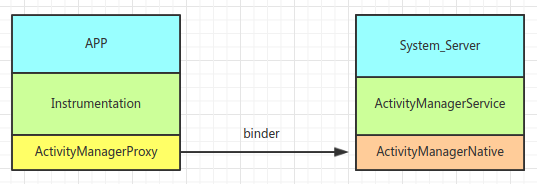

# AMS

## 环境配置

1.创建工程目录
```
mkdir -p ~/ams
```

2.`Android Studio`/`IDEA`导入代码

* `File`->`Open`->`~/ams`
* `File`->`Project Structure`->`Modules`->`ams`
* `Add Content Root`


3.在代码中打上断点

4.调试`system_server`进程
4.1 获取进程号
```
adb ps -eLF | grep system_server
```
4.2 检查`system_server`是否可以调试
```
adb jdwp
```
`system_server`的`pid`在上面的列表中说明可以调试。

4.3 端口映射
```
adb forward tcp:8888 jdwp:${pid}
```

4.4 `attach`调试器
```
jdb -attach localhost:8888
```
>如果`attach`失败，请重启`adb server`再试。

## AMS主要结构



