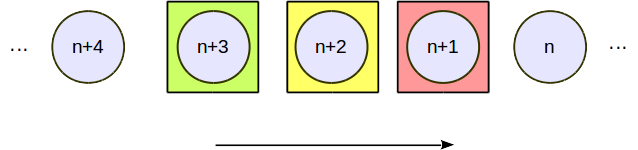

:source-highlight: pygments

[quote,荀子,《劝学篇》]
____
锲而不舍，金石可镂。
____

== WebXR/WebVR Frame 状态管理

=== 状态

所有的 WebXR/WebVR Frame 在渲染过程中都会依次经历三个阶段： Animating、Processing、Rendering，
Animating 阶段表示 Frame 处于 Animating 状态，Processing 阶段表示 Frame 处于 Processing 状态，
Rendering 阶段表示 Frame 处于 Rendering 状态，其余情况下，Frame 处于 Idle 状态。

如图所示，除了 Idle 状态，任何时候都不会出现两个以及两个以上的 Frame 处于同一个状态。

=== 状态切换

在开始说状态切换之前，先说一下状态切换是怎么触发的。在浏览器里面，存在两种进程： **Browser** 和 **Render**。

Browser进程在浏览器中是大佬，Render进程是小弟。此话怎讲？Render进程想要在屏幕上显示画面，需要大佬同意才能显示；
Render进程想要访问网络，需要大佬同意才能进行；Render进程想要访问本地文件，也需要大佬同意才行；反正大佬就把Render
小弟给盯着。既然Render小弟要在屏幕上显示画面，就需要和大佬沟通协调。那应该怎样沟通协调呢？

. Render小弟调用 `GetFrameData(callback)` 向浏览器大佬Browser获取设备位置信息。大佬一般都很忙，哪有什么闲功夫
搭理Render，就说：对不住啊，Render小老弟，大哥我呢最近很忙，没办法亲自把设备的位置信息交给你。你把你的 `callback`
留下，我马上派人去查设备位置信息，一有消息就 `callback` 给你。
. Render就回家等 `callback` ，等 `callback` 来的时候，Render又要求新的设备位置信息，并留下 `callback` ，把根据
设备位置信息绘制的Frame通过 `SubmitFrame` 发给Browser大佬，大佬接收到Frame之后会告诉Render：你发的Frame我已经收到了。

Render的事情就都做完了，重担就落到Browser的肩上，Browser内部的状态机如下图所示。

`pre_frame_complete_fence_` 的状态切换涉及到GPU，这里的状态切换比较复杂一点，先讨论一下CPU是怎样通过GPU来绘图，
GPU怎么通知绘图已经完成。

CPU要绘制图形，首先要准备绘制命令，绘制命令存放在 CommandBuffer中，如下图所示：

在CommandBuffer中，绿色部分是绘制命令，黄色部分是Fence，那么Fence有什么用呢？

CPU把CommandBuffer提交到GPU后，GPU就开始逐条执行，执行到Fence之后，就会唤醒等待在此Fence上面的CPU线程。伪代码如下：
----
Draw draw1,draw2;
Fence fence;
CommandBuffer command_buffer;

command_buffer.insert(draw1);
command_buffer.insert(draw2);
command_buffer.insert(fence);

commit(command_buffer);

wait(fence);//阻塞，直到 fence 被 GPU signal.

// continue...
----

所以，当Frame处于Processing状态，将要切换到Rendering状态时，需要检查 `pre_frame_complete_fence_` ，确保
没有Frame处于Rendering状态，否则线程就一直阻塞在 `pre_frame_complete_fence_` 上面。GPU `signal` `pre_frame_complete_fence_`
之后，处于Rendering状态的Frame切换到Idle状态，处于Processing状态的Frame切换到Rendering状态。

----
wait(pre_frame_complete_fence_);
----

