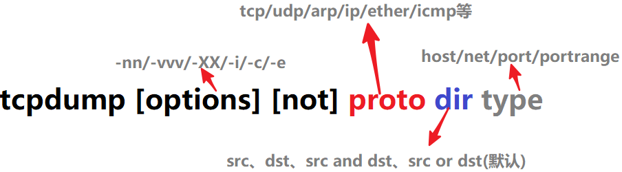

# tcpdump
`tcpdump`命令的构成


# proto

常用的协议有`tcp`，`udp`，`arp`，`ip`，`ether`，`icmp`等，若未给定协议类型，则匹配所有可能的类型。例如`tcp port 21`，`udp portrange 7000-7009`。


## dir

可以给定的值包括`src`，`dst`，`src or dst`，`src and dst`，默认为`src or dst`，例如，`src foo`表示源主机为foo的数据包，`dst net 128.3`表示目标网络为128.3的数据包，`src or dst port 22`表示源或目的端口为22的数据包。

## type

可以给定的值有`host`，`net`，`port`，`portrange`，例如`host foo`，`net 128.3`，`port 20`，`portrange 6000-6008`，默认的type为`host`。

## Example
```
tcpdump -vv -q -XX -n -i wlan0
```

## TCP连接
```
a012 ACK SYN
a002 SYN
8010 ACK
8018 ACK PUSH
c0a8 URG PUSH

30 0d 0a 0\r\n

```

