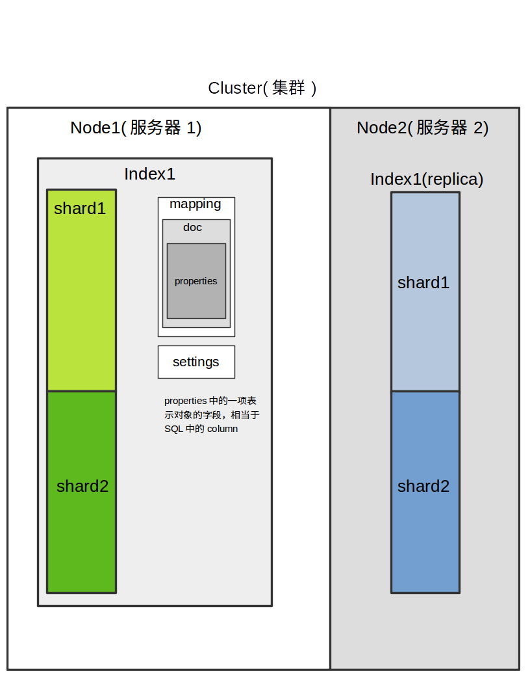
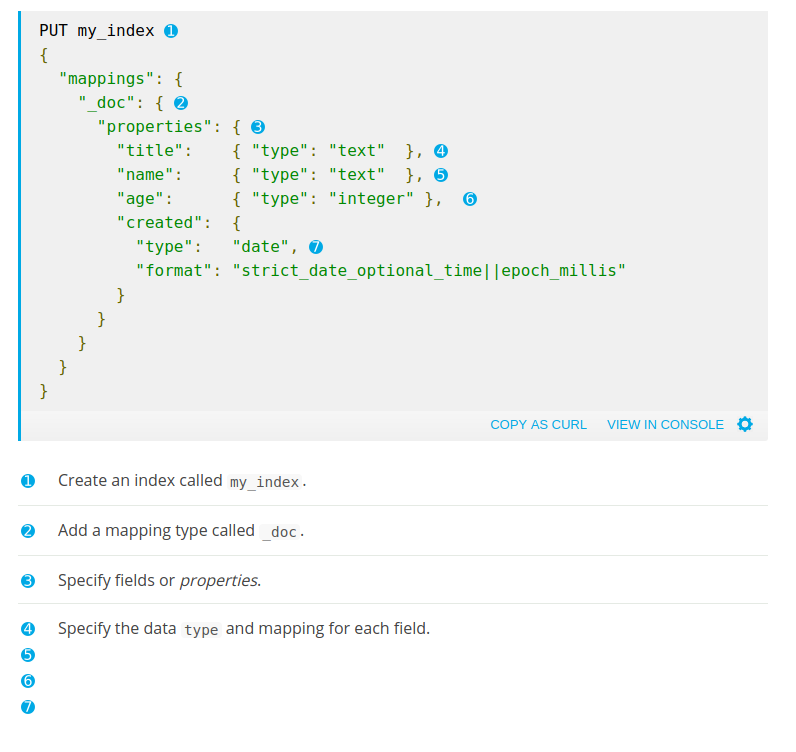

## Index
一个`Index`对应一个`Document Type`，对应与SQL中的Table。




### Mapping Sample
A mapping could be specified when creating an index, as follows:



## logstash
### logstash template
在logstash的`${HOME}/template`下面的文件会 `Installing elasticsearch template to _template/logstash`，在
elasticsearch中的名字就为`logstash`

## 清空上次mysql的访问位置
针对`mysql`中的`id`字段
```
echo 0 > ~/.logstash_jdbc_last_run
```

```
./logstash -f mysql.conf
```
### 常见错误
```
Could not index event to Elasticsearch. {:status=>400, :action=>["index", {:_id=>"6550", :_index=>"cms-video-info", :_type=>"doc", :routing=>nil}, #<LogStash::Event:0x54d65738>], :response=>{"index"=>{"_index"=>"cms-video-info", "_type"=>"doc", "_id"=>"6550", "status"=>400, "error"=>{"type"=>"illegal_argument_exception", "reason"=>"Rejecting mapping update to [cms-video-info] as the final mapping would have more than 1 type: [doc, cms-video-info]"}}}}
```
将`mapping`的`type`从`cms-video-info`改为`doc`

## 分词测试
```
GET cms-video-info/_analyze
{
  "analyzer": "ik_pinyin_analyzer",
  "text": ["张学友"]
}
```
